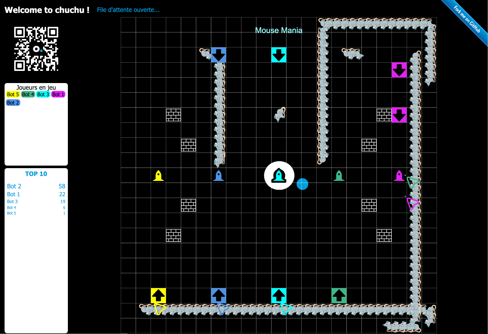
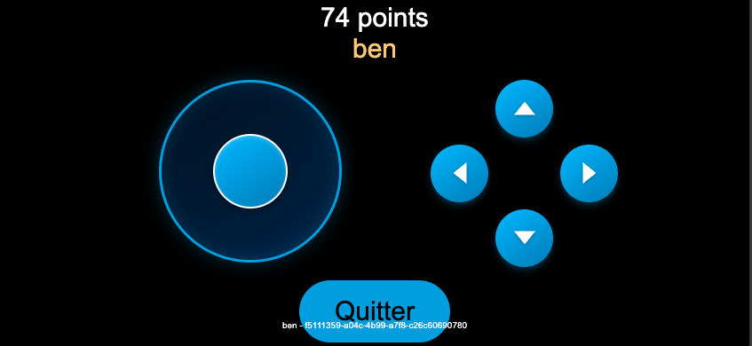
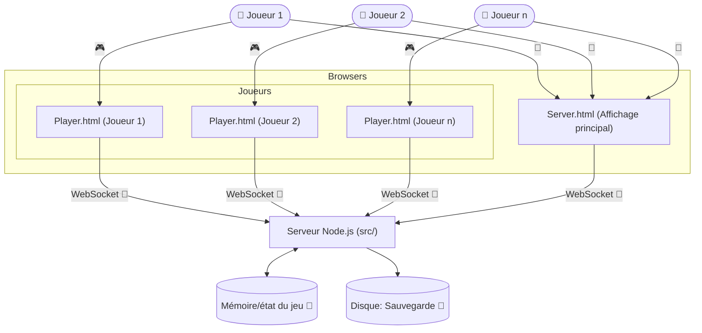

# ChuChuV2


Bienvenue sur ChuChuV2, un remake moderne, multijoueur et open-source du jeu culte ChuChu Rocket! 🧀🐭🚀
Ce projet pousse le concept encore plus loin : jusqu'à 32 joueurs peuvent s'affronter en simultané, alors que l'original se limitait à 4. Attention cependant, à ce niveau, le chaos et la lisibilité ne sont plus garantis... mais c'est aussi ce qui fait tout le sel de l'expérience !
---

## 🎮 Aperçu du jeu



*Exemple d'une partie en cours sur l'affichage principal. Le QRCode en haut à gauche permet aux joueurs de rejoindre la partie facilement depuis leur mobile.*



*Interface de contrôle gamepad moderne avec stick analogique circulaire pour le mouvement (gauche) et boutons directionnels pour placer les flèches (droite). Optimisée pour mobile avec support multi-touch.*

---

## 🎮 Présentation

ChuChuV2 est une réinterprétation fidèle et collaborative du jeu de puzzle/arcade "ChuChu Rocket!", développé à l'origine par Sonic Team et édité par SEGA sur Dreamcast en 1999. Dans ce jeu, vous devez guider des souris (les ChuChus 🐭) vers leur fusée 🚀 tout en évitant les chats (les KapuKapus 🐱), en plaçant des flèches ➡️ sur le plateau pour influencer leur trajectoire. Un immense merci à SEGA et Sonic Team pour ce concept génial et intemporel !

---

## 🛠️ Technologies utilisées

- **TypeScript** 🟦 : langage principal pour la logique métier, le serveur et le front-end.
- **Node.js** 🟩 : exécution du serveur de jeu et gestion des WebSockets.
- **WebSocket** 🔌 : communication temps réel entre le serveur et les clients (joueurs et affichage principal).
- **Webpack** 📦 : bundling du code front-end pour les interfaces serveur et joueur.
- **HTML5 Canvas** 🖼️ : rendu graphique du plateau de jeu côté navigateur.
- **Docker** 🐳 (optionnel) : déploiement et orchestration facilitée.

---

## 🗺️ Architecture du projet



- Les joueurs se connectent via `player.html` (mobile ou desktop) et interagissent en temps réel.
- Le serveur centralise la logique, synchronise l'état et diffuse les mises à jour à tous les clients.
- L'affichage principal (`server.html`) montre l'état du plateau en direct.

---

## 🧩 Fonctionnement du code

- **browser/** 🖥️ : code TypeScript pour l'affichage côté client (canvas, interface joueur, etc.). Les sous-dossiers `player` et `server` gèrent respectivement l'interface du joueur et celle du serveur.
- **src/** 🧠 : logique métier partagée (mouvements, objets du jeu, stratégies, gestion des parties, WebSocket, etc.).
- **static/** 📁 : ressources statiques (images SVG, HTML, CSS).

Le serveur envoie en temps réel l'état du jeu à tous les clients connectés, qui affichent alors la partie en cours. Les joueurs interagissent en plaçant des flèches pour guider les souris. L'ensemble du code est écrit en TypeScript pour une meilleure maintenabilité et évolutivité.

---

## 🧠 Stratégies de jeu et générateurs

Le projet ChuChuV2 est conçu pour être facilement extensible grâce à deux concepts clés :

### 🕹️ Game Strategies (Stratégies de jeu)

- Les stratégies de jeu définissent le comportement global de la partie (placement initial, règles spéciales, intelligence des souris et des chats, etc.).
- Chaque stratégie est implémentée dans `src/generators/strategy/impl/` et peut être sélectionnée ou personnalisée pour varier les modes de jeu (ex : "cat-mania", "mouse-mania", "hurry", etc.).
- Il est facile d’ajouter de nouvelles stratégies pour inventer des variantes ou des défis inédits.

### 🏗️ Generators (Générateurs)

- Les générateurs sont responsables de la création et du placement initial des éléments du jeu (murs, buts, souris, etc.).
- Ils sont organisés par type dans `src/generators/` (ex : `goal/`, `wall/`, etc.) et chaque sous-dossier propose plusieurs implémentations (aléatoire, symétrique, lignes, etc.).
- Cela permet de créer des plateaux variés et de renouveler l’expérience à chaque partie.

---

## 🚀 Lancer un serveur de développement

1. **Installer les dépendances** :
   ```bash
   npm install
   ```
2. **Lancer le serveur** :
   ```bash
   npm run start
   ```

3. **Accéder au jeu** :
   - Ouvrez `http://localhost:8080/server.html` dans un navigateur pour l'affichage principal (plateau de jeu).
   - Ouvrez `http://localhost:8080/player.html` sur un autre appareil ou onglet pour rejoindre la partie en tant que joueur.

---

## 🕹️ À propos de ChuChu Rocket!

ChuChu Rocket! est un jeu de puzzle multijoueur sorti sur Dreamcast en 1999. Le but est de sauver des souris 🐭 en les guidant vers des fusées 🚀 à l'aide de flèches, tout en évitant les chats 🐱. Le jeu est célèbre pour son mode multijoueur frénétique et ses mécaniques de jeu innovantes. Ce projet est un hommage à ce jeu mythique, sans but commercial.

---

## 🙏 Remerciements

Un grand merci à SEGA et Sonic Team pour l'inspiration et la création de ChuChu Rocket! Si vous aimez ce projet, n'hésitez pas à contribuer ou à le partager ⭐

---

*Ce projet est un hommage non commercial à ChuChu Rocket! et n'est affilié ni à SEGA ni à Sonic Team.*
